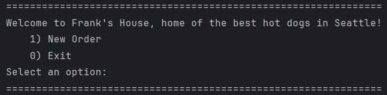
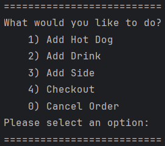
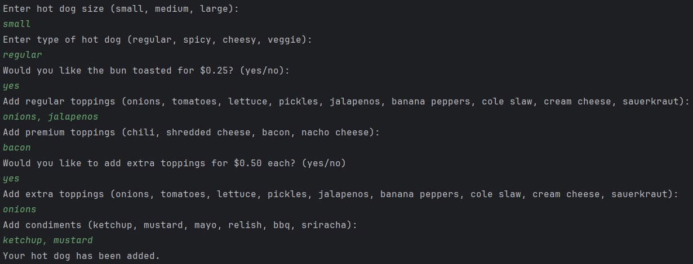
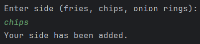
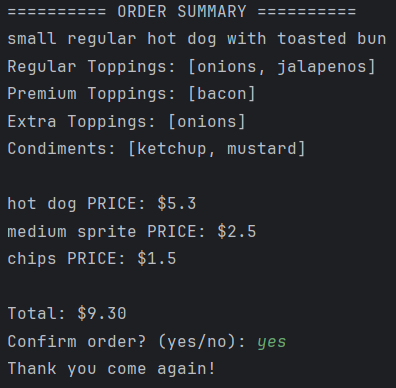
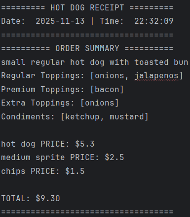

# 🌭 Jenver's Hot Dog Cart 🌭

A console-based Point of Sale (POS) application where users can build and customize hot dogs, drinks, and sides.  
The system validates inputs, generates receipts, and calculates totals just like a real POS.

---
# UML Diagram

---
---

## 📌 Features

### ✅ Hot Dog Builder
Users can customize:
- Size: `small`, `medium`, `large`
- Type: `regular`, `spicy`, `cheesy`, `veggie`
- Bun toasted option (extra cost $0.25)
- Regular toppings (free)
- Premium toppings (extra cost, varies by size)
- Extra toppings (extra cost, varies by size)
- Condiments (free)

### ✅ Drinks & Sides
- Drinks include sizes + preset flavors
- Sides selected from a validated list

### ✅ Order Handling
- Add multiple items to one order
- Cancel order at any time
- Validation forces correct input
- Displays formatted order summary

### ✅ Receipt System
- Saves receipts into a `/receipts` folder
- Shows item breakdown and total
- Prices formatted to two decimal places

---
## Welcome/Display Home Screen: Start new order, Exit

---

---
## Order Screen: Add Hot Dog, Add Drink, Add Side, Checkout, Cancel Order

---

---
## Add Hot Dog Screen: Choose size, type, toasted, regular toppings, premium toppings, extra toppings, condiments

---

---
## Add Drink: Choose size, flavor

---

---
## Add Side: Choose side

---

---
## Checkout Screen: Order Summary, Confirm order saying yes (saves to new receipt), Cancel order saying no

---

---
## Receipt File: Organized Order Summary

---

---
## Interesting Piece of Code:
``` java
// check if input is in the menu items
    public static boolean isValid(String input, String[] validList) {
        // traverses the list of the menu items to check if item is in menu items
        for (String valid : validList) {
            // equalsIgnoreCase compares two strings ignoring difference in string
            if (valid.equalsIgnoreCase(input.trim())) return true; //if item is in the list, return true
        } // trim removes spaces before and after the words
        return false; // if item is not in the menu items list, it is invalid
    }
```

Why it's interesting: This piece of code checks if what the user inputted for these menu items is actually in the array. This piece of code works for adding a hot dog, drink, and size, which is why I find it interesting and also practical instead of writing the same code for each method.

---

---

## Author

**Jenver Fernandez**

📍 Seattle, Washington

## References

Van Putten, M. (2025). LTCA Instructor Year Up United.

OpenAI. (2025). ChatGPT (GPT-5) [Large language model]. https://chat.openai.com/ Features assistance

Mailjard, R. (2025). Capstone project structure checklist. [Advanced Java OOP – Capstone 2: Custom Food Shop Checklist] https://gist.github.com/RemseyMailjard/e9ab857ca4f92459f40de6d0b75b57fb Year Up United.

---
